[English](README.md) | [Українська](README.uk.md) | [Русский](README.ru.md)

# Text Quest Editor

**Text Quest Editor** позволяет вам создавать и использовать текстовые квесты, наподобие квестов в игре «Космические рейнджеры». 
**Text Quest Editor** представлен в виде готовых сборок для платформ Windows, macOS, Linux. 

Готовые квесты можно как проигрывать внутри самого **Text Quest Editor** в качестве тестирования, так и добавлять их внутрь **Text Quest Reader**, который является опен-сорс, и дает возможность видеть и понимать работу квеста, использовать код **Text Quest Reader** для своих проектов, настраивать UI вашего проекта на ваш вкус. 

Эти два проекта работают в связке. 

Квест создается и хранится в формате JSON, что делает данную систему **Text Quest Editor + Text Quest Reader** универсальной для того, чтобы можно было использовать свои квесты в любых своих проектах.

---

## Создание нового квеста

Чтобы создать новый квест:
1. нажмите на кнопку 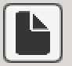
2. Введите название квеста, затем кнопку Accept
3. Название квеста является его ID и в отличие от DisplayName не изменяется и не редактируется
4. Название квеста должно совпадать с названием папки квеста (при созданиии это делается автоматически, главное - не менять названия)

---

## Загрузка квеста

1. Нажмите на кнопку 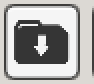
2. Выберите нужный квест 
3. Нажмите на кнопку Load

---

## Сохранение квеста

1. Нажмите на кнопку 
2. Нажмите на кнопку Save
3. Можно сохранять квест через горячие клавиши Ctrl + S (Windows), Cmd + S (macOS)

---

## Просмотр примеров квестов

В репозитории есть готовые квесты
https://github.com/albruevich/QuestEditor_Builds/tree/main/Quests

Чтобы их добавить в редактор нужно:
1. Нажать на кнопку загрузки квестов 
2. Нажать на кнопку Open folder,   операционная система откроет папку Quests
3. Положить скачанные и распакованные квесты в папку Quests
4. Закрыть и открыть (перезагрузить?) панель загрузки квестов

---

## Добавление своих квестов в QuestReader

Чтобы использовать свой квест в QuestReader
1. Нажмите на кнопку сохранения квеста 
2. Нажмите на  кнопку Open folder, откроется папка Quests/YourQuest, скопируйте ее
3. Откройте проект QuestReader через Unity
4. Вставьте папку вашего квеста по адресу Assets/Resources/Quests/
5. Добавьте название папки вашего квесте в Assets/_Settings/Quest Folders List
6. Нажмите кнопку Run (Во время запуска в списке квестов должен появится ваш квест)

---

## Структура квеста

Квест представляет из себя папку, которая совпадает с названием вашего квеста
Внутри нее находится:
- основной файл quest.json 
- папка Images
- папка Sounds
- папка Musics

Эти папки и quest.json создаются автоматически при создании квеста 

После добавления квеста в QuestReader, структура должна получиться такая в Unity:

---

## Основная идея

Создание квеста основывается на трех ключевых понятиях: Параметрах, локациях и переходах. 
1. Создание и редактирование параметров
2. Создание и редактирование локаций
3. Создание и редактирование переходов между локациями
4. Влияние локаций и переходов на параметры
5. Зависимость показа перехода от параметров

---

## Параметры

Рекомендуется начать создания квеста из создания нескольких ключевых параметров, например: золото, здоровье, настроение

#### 1. Для этого нажмите на кнопку 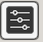
#### 2. Нажмите на бокс слева от «Add parametr» 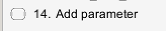
#### 3. Дайте ему Working title (это рабочее название, не для отображения)

#### 4. Значения параметров

У каждого квеста есть минимальное, максимальное, и стартовое значение. Укажите их и нажмите на кнопку Apply. 

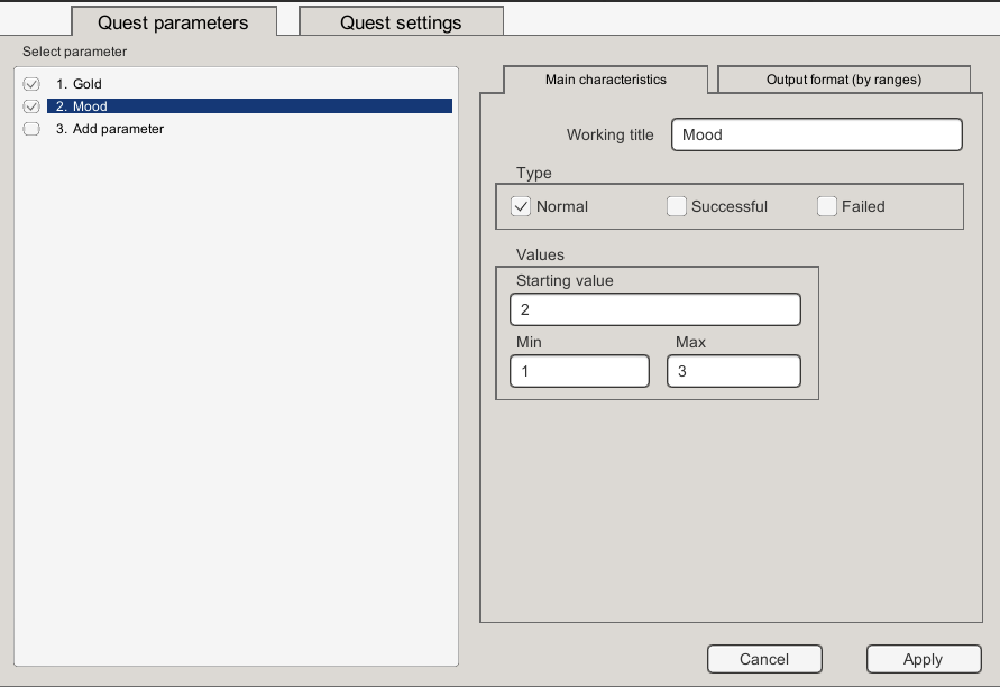

#### 5. Отображение параметров

Вы можете отображать свои параметры разными способами
В данном примере при помощи кнопок «-» «+» отрегулированы ранги для отображений в количестве 3. 
Если Mood будет равен 1 то во время игры будет показано: You are furious.
Если Mood будет 2, то будет показано Normal mood

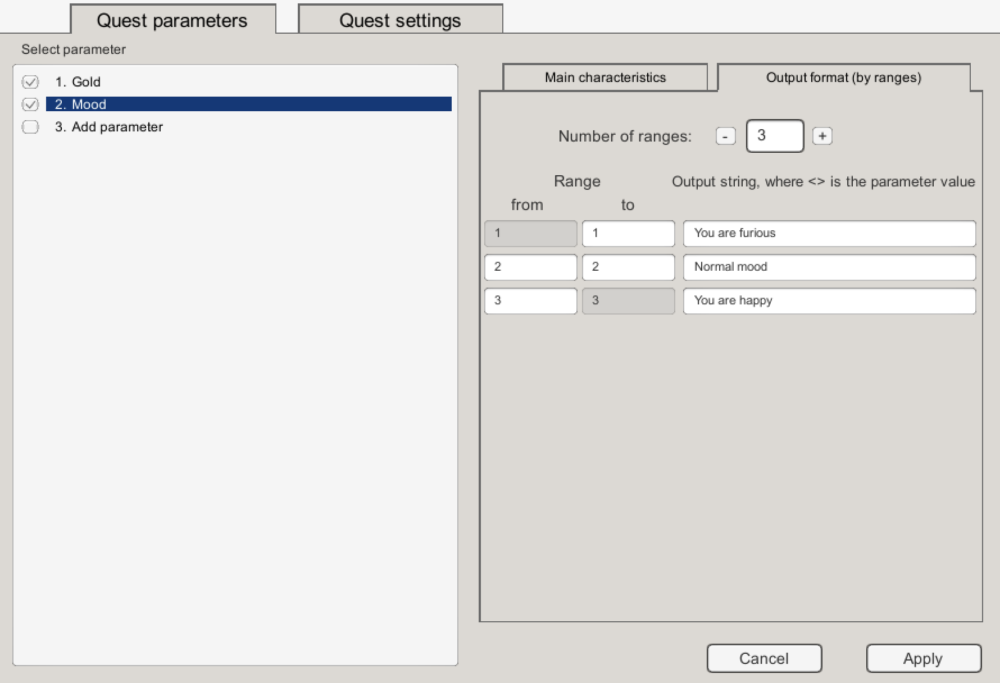

Если же вы хотите показывать значение параметра, то на месте ‘<>’ во время игры отобразится его значение:

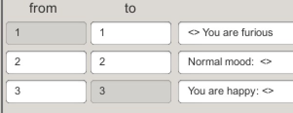

В игре это отобразится так:

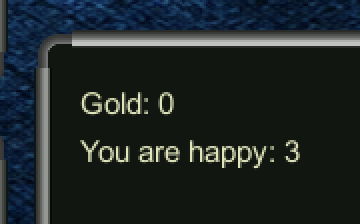

Также вы можете в отображении указывать значения других параметров. Например для отображения счета в игре между командами:

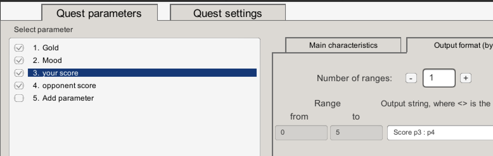

В игре это отобразится так:

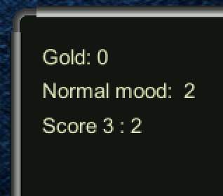

При этом, параметры могут вообще не отображаться никогда, для этого достаточно оставить это поле пустым:

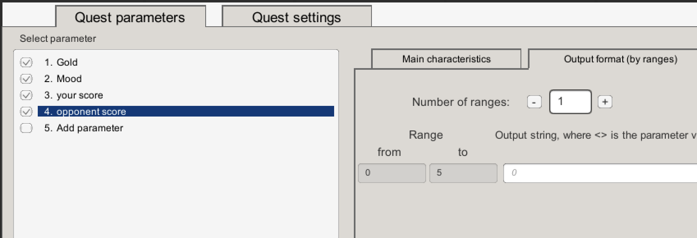

#### 6. Тип параметров

Параметры могут быть 3-х типов: **Нормальный, Успешный, Проваленный**

Нормальный тип параметра не влияет на то, завершится ли квест провалом или успехом. Например параметр Mood у нас нормальный и в редактировании у него нет критических значений. 

Если же вы выбрали успешный или проваленный тип, то квест будет завершен успехом/поражением при достижении критического значения. 
В этом примере игра будет завершена успехом, как только игрок наберет 10 золотых монет. В таком случае при победе будет показан победный текст. 
(Также можно будет добавлять изображения и звуки для достижения критических значений, но об этом будет рассказано позже)

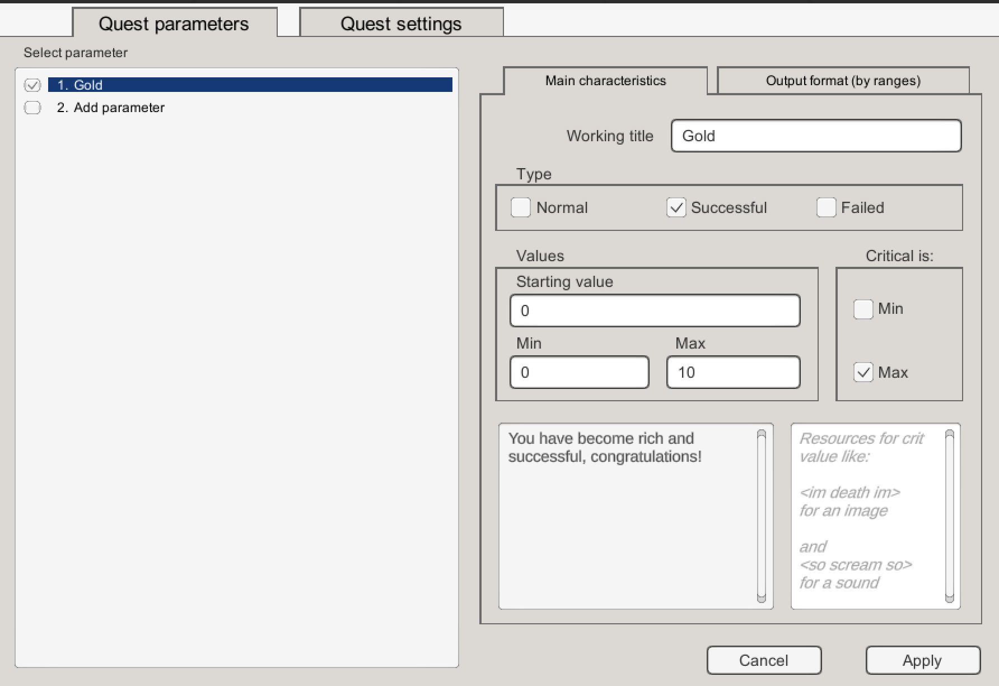

#### 7. Деактивация параметров. 
Вы можете решить отключить параметр нажав на галочку в боксе слева от параметра. 
В таком случае он перестанет использоваться в квесте

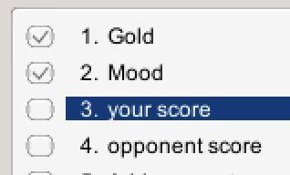

---

## Основные настройки квеста

Вы можете настроить свой квест нажав на кнопку

Вкладка «Quest settings». 

Тут вы можете настроить значения квеста для показа в QuestReader:
1. Display Name
2. Start music 
3. Start image 
4. Описание квеста 

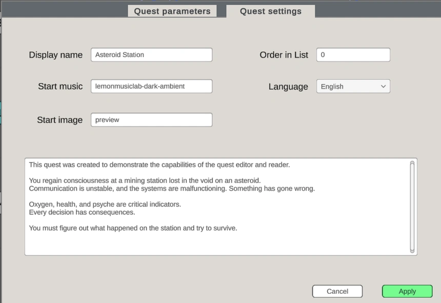

---

## Режимы

В редакторе есть три основных режим: режим локаций, режим переходов, режим перемещения

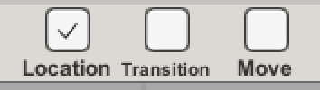

1. Если включен режим локаций то при клике левой кнопки мыши на рабочей зоне (на сетке), появится панель создания новой локации
2. Если включен режим переходов, то кликните ЛКМ на первой локации, затем ЛКМ на вторую локацию. После этого Появится панель создания нового перехода. (Кстати первая и вторая локации могут быть одной и той же локацией). 
3. Если включен режим перемещения, то ЛКМ на локации перемещает локацию на пустую клетку, а ЛКМ на переходе дает возможность перемещать переходы между локациями. При этом имеет значение где был первый клик - на хвост или на голову перехода. 

---

## Правый клик
1. ПКМ на локации или на переходе открывает панели редактирования локаций / переходов. 
2. Если выбран режим переходов и выбрана начальная локация для создания перехода, то ПКМ дает возможность отменить создание перехода. 

---

## Отмена действий

Если вы ошиблись в чем-то, то эти кнопки дают вам возможность отменить ваше действие. Либо отменить отмену действия (redo). 
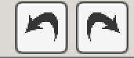

---

## Редактирование локаций

Для редактирования локаций ПКМ на существующую локацию, лобо ЛКМ на пустую клетку в режиме локаций. 
Это запускает панель редактирования / создания локаций. 

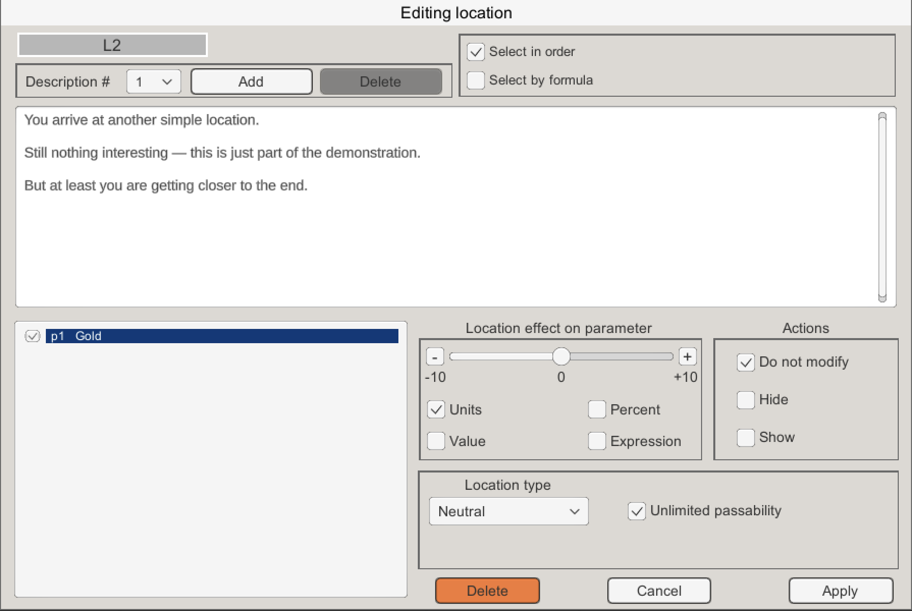

#### 1. Описания локаций
В основном текстовом поле вы можете редактировать описание локации. 
В одной локации может быть несколько описаний. 
Чтобы добавить описание к локации нажмите кнопку «Add». 
Чтобы выбрать описание для редактирования используйте дроп бокс:

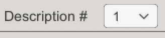

Описания можно удалять. 

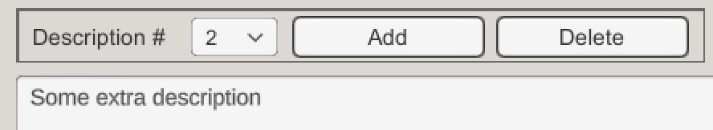

Если выбран «Select in order» чек-бокс, то описания будут чередоваться по очереди. 

Если выбран «Select by formula» чек-бокс, то описания будут выбираться соответственно формуле. 
Например формула: p1 > 5 ? 1 : 2 означает что если p1 (золото) больше 5 то будет показано описание 1, иначе 2

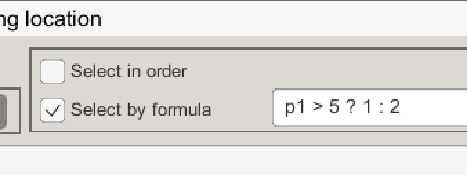

Либо другой пример формулы: p2 + 1.

Если пистолет есть, то покажется второе описание: p2 (1, так как есть пистолет) + 1 = 2 (второе описание)

Если пистолета нет, то покажется первое описание: p2 (0, так как пистолета нет) + 1 = 1 (первое описание)

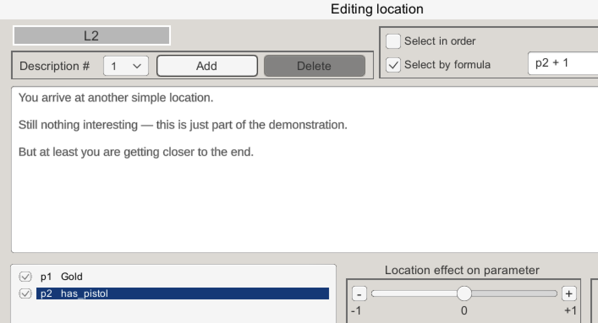

Сами описания локаций могут принимать значения параметров и формулы. 
Например. «Вы сегодня так устали, Ваше здоровье где-то на {p3}». 
В игре же будет показано:  «Вы сегодня так устали, Ваше здоровье где-то на 7». 
Или "Он отдал вам ровно половину своих денег: {p1 / 2}"

#### 2. Типы локаций

Локации могут быть разных типов: Нейтральная, Стартовая, Победная, Проваленная, Пустая. 

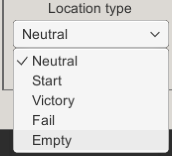

**Нейтральная** - никак не влияет на ход игры сама по себе. 

**Стартовая** - именно с нее начинается квест. Может быть только одна стартовая локация. 

**Победная** - на этой локации квест завершается победной. 

**Проваленная** - на ней квест завершается победной. 

**Пустая** - если локация показана как пустая, то ее описание не будет показано, вместо него будет показано описание из перехода, который к ней привел. 

#### 3. Проходимость

Вы можете ограничить количество посещений локации. По умолчанию локация создается с неограниченной проходимостью (игрок может попадать в нее бесконечное количество раз). 

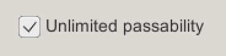

Если же вы хотите ограничить проходимость, то снимите галку с чекбокса «неограниченная проходимость» и установите ограничение.
Например игрок пришел к другу 3 раза, а на 4-й раз замок висит на двери, и надпись: «Надоел ты мне своей назойливостью»

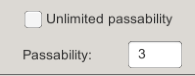

Также это очень удобно чтобы делать локации одноразовыми. 

#### 4. Влияние локации на параметры

Когда игрок попадает в локацию, она может изменить любой параметр. 
Для этого нужно выбрать параметр. 

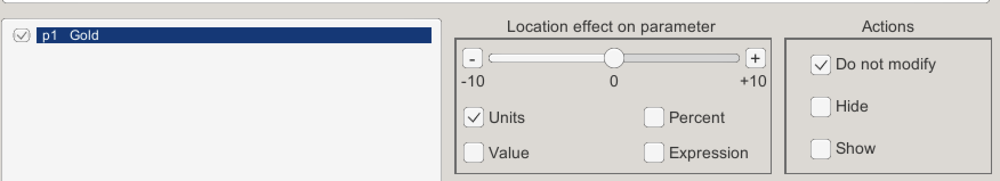

**Действия**
 
Локация может показать параметр, и в таком случае он будет показан в игре в окне параметров. 
Локация может скрыть параметр. 
Либо ничего не делать (не показывать и не прятать), этот флажок стоит по умолчанию. 

**Влияние на значения параметров**

Есть 4 переключателя: Units, Value, Percent, Expression

Если выбран флажок «Units», то локация может прибавить число к текущему значению параметра либо убавить. Например было 2 золота, локация указывает +3. При подадании в эту локацию золота станет 5 (но не больше чем максимальное и минимальное значение параметра).

Если выбран флажок «Value», то устанавливается ровно такое значение, какое указано в локации. Например было 2 золота, а локация устанавливает 0. Больше золота у игрока нет. 

Если выбран флажок «Percent», то локация прибавляет или отнимает относительное значение от параметра. Например, было 10 золота, локация отнимает 50%. Теперь у игрока стало 5 золота. 

Если выбран флажок «Expression», то значение параметру устанавливается по формуле. Например в квесте «Астероидная станция» каждый переход убавлял кислород на 2 если пробоина не была устранена. p1 + (p11 == 0 ? -2 : 0)
Здесь p1 — кислород, p11 — пробоина залатана. 
Формулы могут быть самыми разными. Например выбрать параметр p1 — золото, и в формуле установить (p2 + p5) / 2. То есть, при попадании в локацию золота у игрока станет: количество часов работы + премия и все это поделить на 2. 

**Рандом**

Все формулы могут принимать рандом. Например в квесте «астероидная станция» пистолетный выстрел наносит монстру урон:
p9 - rnd(1, 3)
p9 — это здоровье монстра минус случайное число от 1 до 3

---

## Переходы

Аналогично с локациями они могут иметь проходимость, показывать и прятать параметры, влиять на параметры. 
Об этом больше нет смысла тут говорить. 

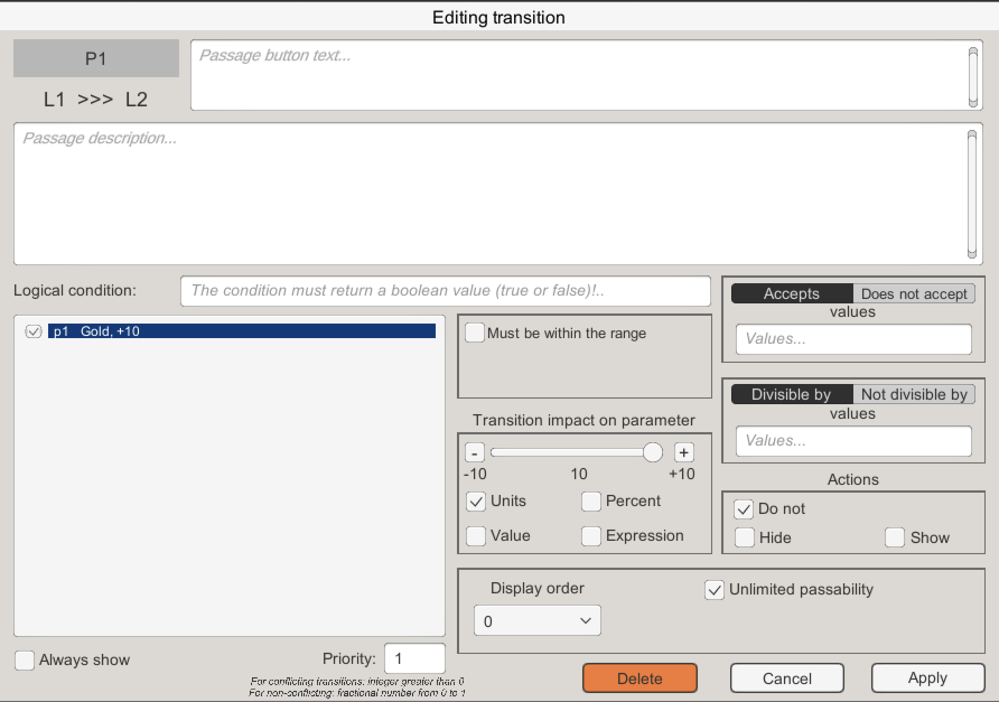

Но есть и отличия.
В переходах всегда только одно описание. И обязательный текст для кнопки перехода
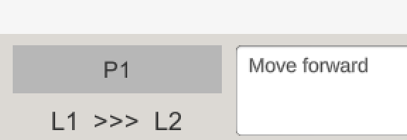

В игре это будет отображаться так:
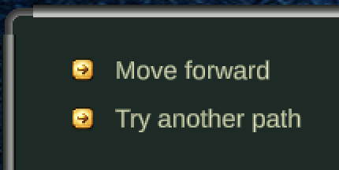

Будет ли показан переход или нет зависит от нескольких факторов:

### 1. Logical condition
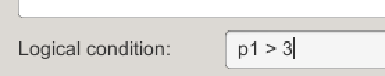

Тут пишется формула при которой переход будет показан. 
В этом примере переход будет показан только в том случае, если золота больше 3

### 2. Диапазон
Переход будет показан только в том случае, если значение выбранного параметра находится в пределах диапазона. 
Например, переход будет показан только если золота от 1 до 4

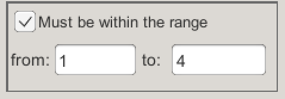

### 3. Принимает / не принимает значения
Переход будет показан только в том случае, если значение выбранного параметра принимает / не принимает значения. 
В этом примере переход будет показан только в том случае, если выбранный параметр p1 (золото) принимает значения: 1 или яблоки минус 2, или случайное число от 3 до 10

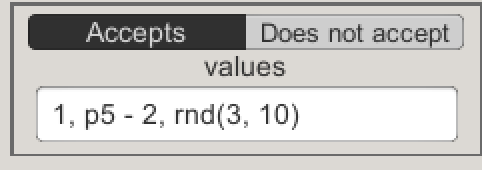

4.Кратное / не кратное значениям
Переход будет показан только в том случае, если значение выбранного параметра будет кратно / не кратно указанным значениям

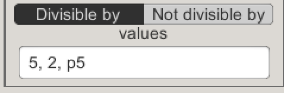

### 5. Нужно учесть что переход будет показан только при исполнении всех условий:  Logical condition, Диапазон, Принимает / не принимает значения, Кратное / не кратное значениям. 
Советуем начинать практиковаться только с чего-то одного, чтобы не запутаться в сложной логике и не потерять нить квеста при создании и тестировании. 

### 6. Порядок показа
Когда переходов несколько то один может быть отображено выше, другой ниже в игре

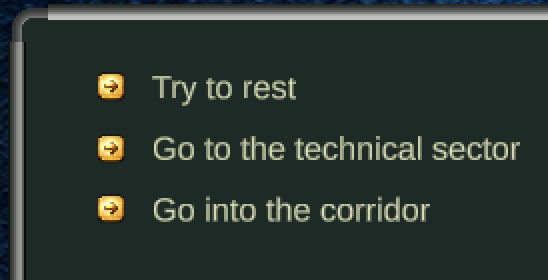

Управлять этим можно через «Display order»
Чем ниже значение, тем выше кнопка перехода будет показана в игре
Если Display order одинаковый у переходов, то порядок показа будет выбран случайно

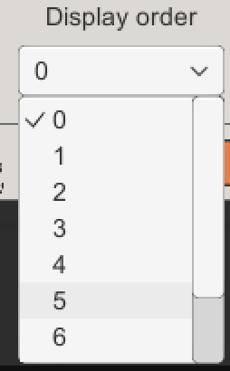

### 7. Приоритет
В квесте может быть несколько переходов с одинаковым названием кнопок. Такие переходы называются спорными и в редакторе отображаются красным цветом. 

Например в квесте «Астероидная станция» такие переходы дают возможность убежать от монстра, они одинаково называются «Run from the monster to the technical sector»
только один ведет к проваленной локации, а второй дает убежать. 

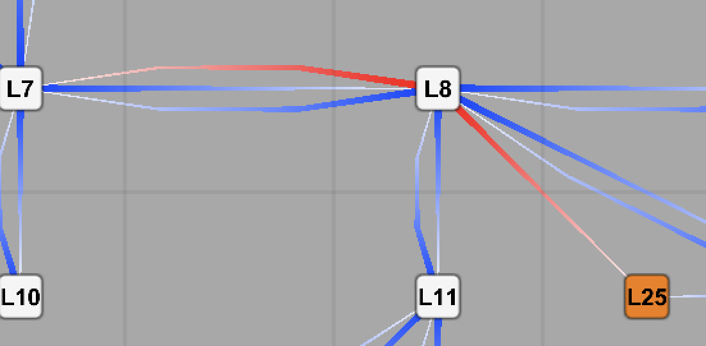

Шанс на срабатывание спорного перехода определяется приоритетом (весом). Чем больше значение, тем выше шанс, что покажется именно этот переход

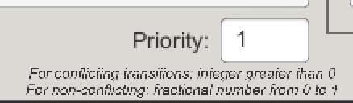

В нашем примере шанс на спасение 3, а на гибель 7. Соответственно 30 и 70 процентов

Также есть в квесте вероятностные переходы (это не спорные переходы), у них тоже есть приоритет показа. В таком случае пишем дробное число от 0 до 1. 
Например если такому переходу поставить значение 0.5, то он появится с вероятностью в 50 процентов

### 8. Серые (неактивные переходы) / Всегда показывать
Так как в квесте для показа перехода должны выполниться некоторые условия (хоть и не всегда), то есть возможность показать потенциальный переход серым / неактивным цветом

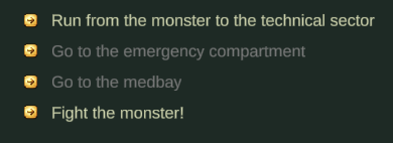

Например недоступно пройти в Медблок или в аварийный отсек (так как монстр закрывает дорогу, условия показа перехода не выполнены). 
Но поставив галку «Всегда показывать», можно отображать такие переходы как неактивные. Они дают игроку надежду, намеки, пищу для размышлений. 
 
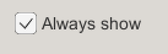

---

## Работа с ресурсами

Для использования ресурсов в локациях, переходах и критических параметрах, можно использовать теги в виде:
Для изображений
<im your_biautiful_picture im>

Для музыки
<mu your_music mu>

Для звуков
<so your_sound so>

После этого закиньте все свои ресурсы в соответствующие папки квеста. 
Можно начать на кнопку сохранения квеста -> open folder и увидеть все папки куда класть свои ресурсы. 

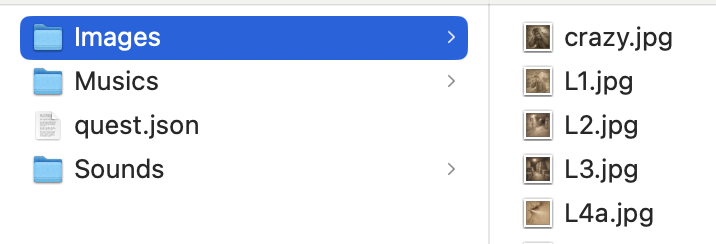

Изображения должны быть в формате .png, jpg, jpeg

Звуковые файлы в формате .mp3, .wav, .ogg

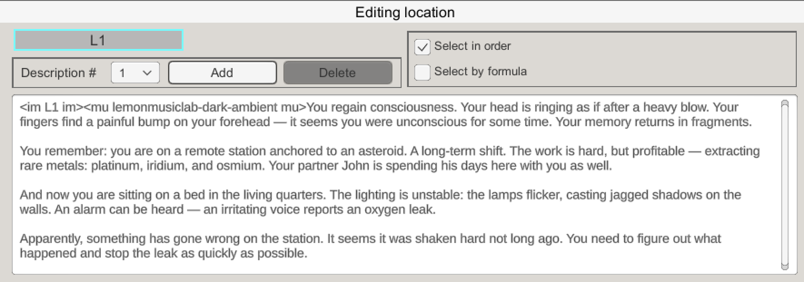

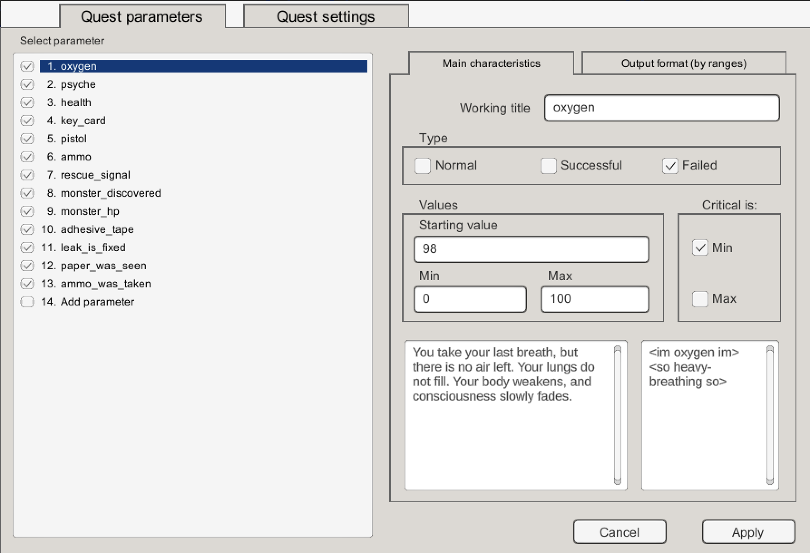

Когда обновляете ресурсы в папках, то для того чтобы вступили изменения в силу нажимайте на эти кнопки (так как в редакторе используется кеширование ресурсов). Перезапуск редактора также активирует изменения обновлений ресурсов. 

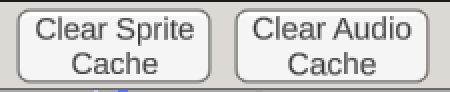

---

## Игровой режим

Для запуска и отладки квеста нажмите на кнопку
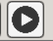

Вы сможете прогнать свой квест, установить ему временно параметры только для тестирования, отмотать прохождение назад

---

## Разное

Вы можете выключить / включить подсказки - текст вверху, который напоминает о режимах
Если включены подсказки, то также при наведении на элементы квеста (локации и переходы), будут появляться тултипы с инфой про элементы квеста

Можете выключить / включить сетку 
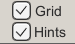

Вы также можете посмотреть короткое инфо об управлении Редактором через мышь
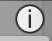

Хвост перехода (from) синего цвета и широкий, голова перехода (to) белого цвета и узкая
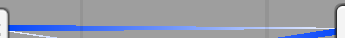

---

## Советы

Не беритесь сразу за сложный квест. Для начала напишите небольшой квест из 5 - 10 локаций. Т.е. учитесь пользоваться редактором потихоньку. При создании маленького квеста вы получите необходимый навык и уже не повторите старых ошибок, когда будете делать что-то более сложное.

