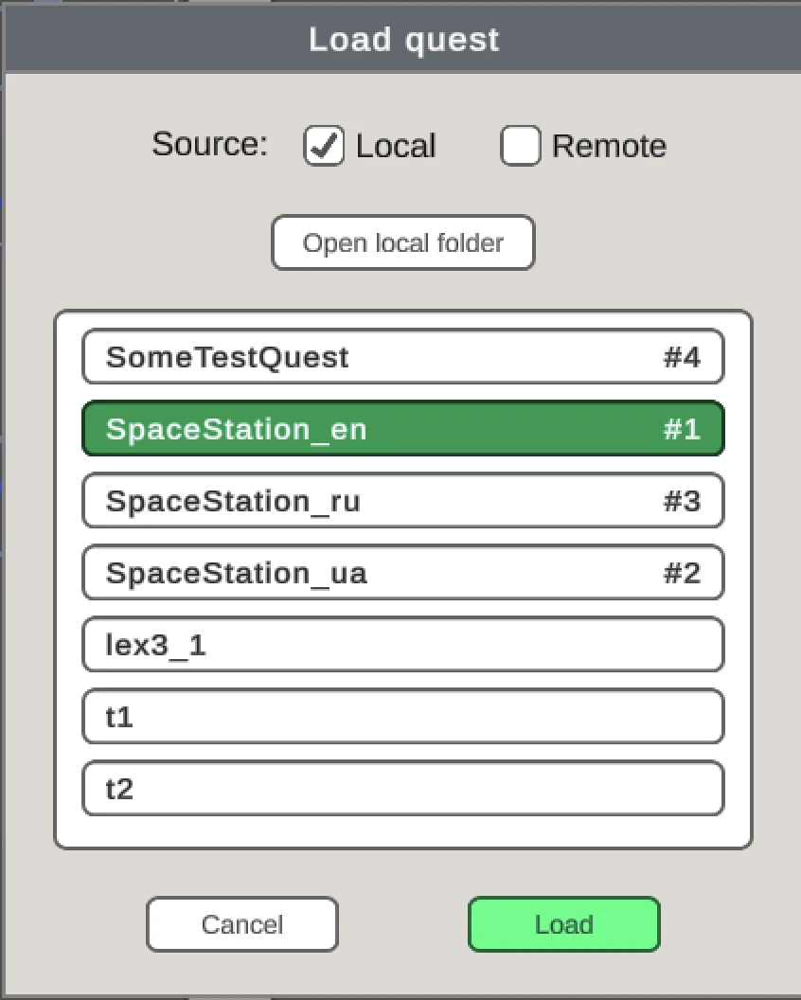
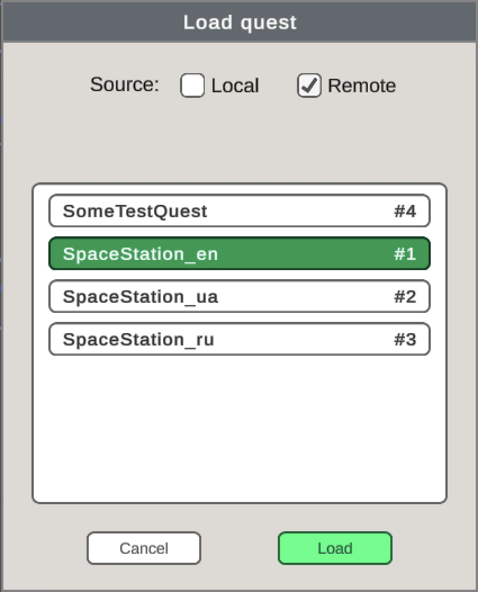
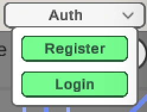
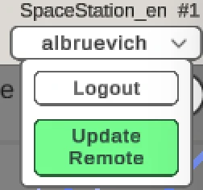

[English](README.md) | [Українська](README.uk.md) | [Русский](README.ru.md)

# 🛠 **Text Quest Editor**

🛠 **Text Quest Editor** дозволяє створювати та використовувати текстові квести, натхненні механіками ігор типу «Космічні рейнджери».

Редактор розповсюджується у вигляді готових збірок для платформ Windows та macOS.

Проєкт складається з двох частин:
- 🛠 **Text Quest Editor** — інструмент для створення та тестування квестів,
- [**Text Quest Reader**](https://github.com/albruevich/Text-Quest-Reader) — open-source Unity runtime для запуску та інтеграції квестів у власні проєкти.

Квести можна:
- запускати прямо в 🛠 **Text Quest Editor** для тестування,
- підключати до Unity-проєкту [**Text Quest Reader**](https://github.com/albruevich/Text-Quest-Reader),
- публікувати на сервері, після чого вони стануть доступними в [**Text Quest Reader**](https://github.com/albruevich/Text-Quest-Reader).

[**Text Quest Reader**](https://github.com/albruevich/Text-Quest-Reader) дозволяє:
- бачити та розуміти, як працює квест,
- використовувати його код у власних проєктах,
- налаштовувати UI під свої задачі.

Квести створюються та зберігаються у форматі JSON, що робить зв’язку 🛠 **Text Quest Editor** та [**Text Quest Reader**](https://github.com/albruevich/Text-Quest-Reader) універсальним рішенням для використання текстових квестів у будь-яких проєктах.

---

## Зміст

- [Швидкий старт](#швидкий-старт)
- [Створення нового квесту](#створення-нового-квесту)
- [Завантаження квесту](#завантаження-квесту)
- [Локальні та віддалені квести](#локальні-та-віддалені-квести)
- [Локальне збереження квесту](#локальне-збереження-квесту)
- [Приклади квестів](#приклади-квестів)
- [Додавання квесту до Text Quest Reader](#додавання-квесту-до-text-quest-reader)
- [Структура квесту](#структура-квесту)
- [Основна ідея](#основна-ідея)
- [Параметри](#параметри)
- [Основні налаштування квесту](#основні-налаштування-квесту)
- [Режими](#режими)
- [Локації](#редагування-локацій)
- [Переходи](#переходи)
- [Робота з ресурсами](#робота-з-ресурсами)
- [Ігровий режим](#ігровий-режим)
- [Різне](#різне)
- [Поради](#поради)

---

## Швидкий старт

1. Створіть новий квест
2. Додайте 1–2 параметри (наприклад: золото)
3. Створіть стартову локацію
4. Додайте ще одну локацію
5. З’єднайте їх переходом
6. Натисніть Play

Готово — у вас є перший робочий квест.

---

## Готові збірки

Завантажити можна тут:  
👉 [Text Quest Editor Releases](https://github.com/albruevich/Text-Quest-Editor/releases)

### Як запустити

1. Завантажити архів під свою платформу  
2. Розпакувати  
3. Windows: запустити `.exe`  
4. macOS: відкрити `.dmg` та перенести застосунок в Applications

---

## Попередження безпеки macOS

Якщо macOS блокує застосунок із повідомленням:

> «Застосунок не може бути відкритий, оскільки не вдалося перевірити його розробника»

Зробіть наступне:

1. Відкрийте:
   `Системні параметри → Конфіденційність і безпека`

2. Прокрутіть вниз до розділу безпеки

3. Натисніть:
   **Open Anyway / Усе одно відкрити**

4. Підтвердьте запуск застосунку

Після першого запуску застосунок відкриватиметься нормально.

---

## Створення нового квесту

Щоб створити новий квест:
1. Натисніть кнопку 
2. Введіть назву квесту та натисніть **Accept**

---

## Завантаження квесту

1. Натисніть кнопку 
2. Виберіть потрібний квест
3. Натисніть кнопку **Load**

---

## Локальні та віддалені квести

У редакторі доступні два джерела квестів:

- **Local** — квести, збережені на вашому комп’ютері.
- **Remote** — квести, завантажені із сервера.

У панелі завантаження можна перемикатися між локальними та віддаленими квестами.

Якщо сервер недоступний, вкладка **Remote** буде вимкнена.

Квести, завантажені із сервера, мають унікальний ID, який відображається праворуч від назви.

Наприклад: `#1`

Цей ID використовується для ідентифікації квесту на сервері.

<table>
<tr>
<td>

</td>
<td>

</td>
</tr>
</table>

---

Для публікації квестів на сервері необхідно авторизуватися.

Після авторизації:
- нові квести можна публікувати віддалено,
- вже опубліковані квести можна оновлювати,
- ваші квести будуть позначені як такі, що належать вам.

---

## Авторизація

Щоб відкрити панель авторизації:
1. Натисніть кнопку **Auth**
2. Зареєструйтеся або увійдіть в акаунт

Після входу стають доступними:
- публікація квестів,
- оновлення віддалених квестів,
- керування своїми remote-квестами.

---

## Локальне збереження квесту

Квести можна зберігати локально на комп’ютер, включно з квестами, завантаженими із сервера.

1. Натисніть кнопку 
2. Натисніть кнопку **Save**
3. Також можна використовувати гарячі клавіші:
   - **Ctrl + S** (Windows)
   - **Cmd + S** (macOS)

---

## Приклади квестів

У репозиторії доступні приклади [квестів](https://github.com/albruevich/QuestEditor_Builds/tree/main/Quests) для локального використання.

Щоб додати їх до редактора:
1. Натисніть кнопку завантаження квестів 
2. Натисніть кнопку **Open folder** — відкриється папка `Quests`
3. Помістіть завантажені та розпаковані квести в цю папку
4. Закрийте та знову відкрийте панель завантаження квестів, щоб оновити список

---

## Додавання квесту до [**Text Quest Reader**](https://github.com/albruevich/Text-Quest-Reader)

Квести можна використовувати:
- у Unity-проєкті [**Text Quest Reader**](https://github.com/albruevich/Text-Quest-Reader),
- або в готовому застосунку [**Text Quest Reader APP**](https://github.com/albruevich/Text-Quest-Reader/releases) для Windows та macOS.

Для локального додавання квесту:

1. Натисніть кнопку збереження квесту 
2. Натисніть кнопку **Open folder** — відкриється папка `Quests/YourQuest`
3. Скопіюйте папку квесту

### У Unity-проєкт

1. Відкрийте проєкт [**Text Quest Reader**](https://github.com/albruevich/Text-Quest-Reader) в Unity
2. Вставте папку квесту за шляхом:
   `Assets/StreamingAssets/Quests/`
3. Натисніть кнопку **Run** — квест з’явиться у списку доступних

### У готовий застосунок [**Text Quest Reader APP**](https://github.com/albruevich/Text-Quest-Reader/releases)

1. Запустіть застосунок **Text Quest Reader**
2. Натисніть кнопку **Add Quests**
3. Скопіюйте папку квесту в папку, що відкрилася
4. Натисніть кнопку **Refresh** або перезапустіть застосунок — квест з’явиться у списку доступних

---

## Структура квесту

Квест являє собою папку, яка збігається з назвою вашого квесту.

При локальному використанні назву папки не можна змінювати.

Всередині неї знаходяться:
- основний файл `quest.json`
- папка `Images`
- папка `Sounds`
- папка `Musics`

Ці папки та quest.json створюються автоматично при створенні квесту.  

Після додавання квесту до Unity-проєкту [**Text Quest Reader**](https://github.com/albruevich/Text-Quest-Reader) структура виглядатиме так:

---

## Основна ідея

Створення квесту будується на трьох ключових елементах: параметрах, локаціях і переходах.

1. Створення та редагування параметрів
2. Створення та редагування локацій
3. Створення та редагування переходів між локаціями
4. Вплив локацій і переходів на параметри
5. Умови відображення переходів залежно від параметрів

---

[↑ До змісту](#зміст)

---

## Параметри

Рекомендується починати створення квесту з налаштування кількох ключових параметрів, наприклад: золото, здоров’я, настрій.

#### 1. Створення параметра

1. Натисніть кнопку 
2. Натисніть на поле ліворуч від «Add parameter» 
3. Вкажіть **Working title** (робочу назву, яка не відображається в грі)

---

#### 2. Значення параметра

У кожного параметра є:
- мінімальне значення,
- максимальне значення,
- стартове значення.

Задайте їх і натисніть кнопку **Apply**.

---

#### 3. Відображення параметра

Параметри можна відображати різними способами.

У цьому прикладі налаштовані ранги відображення (3 рівні):
- якщо Mood = 1 → буде показано: *You are furious*
- якщо Mood = 2 → буде показано: *Normal mood*

---

Якщо ви хочете відображати числове значення параметра, використовуйте `<>` — під час гри воно буде замінене на поточне значення:

У грі це виглядає так:

---

Також можна використовувати значення інших параметрів.  
Наприклад, для відображення рахунку між командами:

У грі це виглядає так:

---

Якщо поле відображення залишити порожнім, параметр не буде показуватися в грі:

---

#### 4. Тип параметра

Параметри можуть бути трьох типів: **Нормальний**, **Успішний**, **Провальний**

- **Нормальний** — не впливає на завершення квесту  
- **Успішний** — завершує квест перемогою при досягненні критичного значення  
- **Провальний** — завершує квест поразкою при досягненні критичного значення  

Наприклад: якщо параметр золота досягає 10, квест завершується перемогою.

*(Для критичних значень також можна задати зображення та звуки — про це буде розказано пізніше.)*

---

#### 5. Деактивація параметра

Ви можете вимкнути параметр, знявши галочку в боксі ліворуч від нього.

У цьому випадку параметр не буде використовуватися в квесті.

---

[↑ До змісту](#зміст)

---

## Основні налаштування квесту

Щоб відкрити налаштування квесту:
1. Натисніть кнопку 
2. Перейдіть у вкладку **Quest settings**

Тут налаштовуються параметри квесту, які відображаються в [**Text Quest Reader**](https://github.com/albruevich/Text-Quest-Reader) при його виборі:

1. Display Name  
2. Start Music  
3. Start Image  
4. Опис квесту
5. Order in list — визначає позицію квесту у списку квестів. Чим менше значення, тим вище відображається квест.
6. Language

**Language** визначає мову системних елементів квесту в [**Text Quest Reader**](https://github.com/albruevich/Text-Quest-Reader):

- текст кнопки **Next**,
- повідомлення перемоги та поразки,
- мовну мітку квесту у списку, наприклад `[EN]`.

---

## Режими

У редакторі є три основні режими: режим локацій, режим переходів і режим переміщення.

1. **Режим локацій**  
   При кліку лівою кнопкою миші по робочій області (сітці) відкривається панель створення нової локації.

2. **Режим переходів**  
   Клікніть лівою кнопкою миші по першій локації, потім по другій. Після цього відкриється панель створення переходу.  
   *Примітка: можна створити перехід, який веде в ту саму локацію, з якої він починається.*

3. **Режим переміщення**  
   - Клік лівою кнопкою миші по локації дозволяє перемістити її на вільну клітинку.  
   - Клік лівою кнопкою миші по переходу дозволяє змінити його положення між локаціями.  
     При цьому важливо, де був зроблений перший клік — на початку (хвості) або кінці (голові) переходу.

---

### Правий клік

1. Клік правою кнопкою миші по локації або переходу відкриває панель їх редагування.
2. У режимі переходів, якщо вже вибрана початкова локація, правий клік скасовує створення переходу. 

---

### Скасування дій

Якщо ви допустили помилку, використовуйте ці кнопки для скасування останньої дії (Undo) або її повторного виконання (Redo).

---

## Редагування локацій

Щоб відкрити панель редагування локації:
- натисніть правою кнопкою миші по існуючій локації,  
- або лівою кнопкою миші по порожній клітинці в режимі локацій.

Відкриється панель редагування або створення локації.

#### 1. Описи локацій

В основному текстовому полі ви можете редагувати опис локації.

В одній локації може бути кілька описів.  
Щоб додати новий опис, натисніть кнопку «Add».  
Для вибору опису використовуйте випадаючий список:

Описи можна видаляти.

Якщо увімкнений чек-бокс «Select in order», описи будуть показуватися по черзі.

Якщо увімкнений чек-бокс «Select by formula», опис буде вибиратися на основі формули.

Наприклад:  
`p1 > 5 ? 1 : 2`  
Якщо p1 (золото) більше 5 — буде показано опис №1, інакше — №2.

Інший приклад:  
`p2 + 1`

Формула повертає номер опису.

- Якщо в гравця є пістолет (p2 = 1), результат буде 2 — показується опис №2.  
- Якщо пістолета немає (p2 = 0), результат буде 1 — показується опис №1.

**Описи можуть містити параметри та формули.**

Наприклад:  
`Ви сьогодні так втомилися, Ваше здоров’я десь на {p3}`  
У грі буде показано:  
`Ви сьогодні так втомилися, Ваше здоров’я десь на 7`

Або:  
`Він віддав вам рівно половину своїх грошей: {p1 / 2}`

#### 2. Типи локацій

Локації можуть мати різні типи: **Нейтральна, Стартова, Переможна, Провальна, Порожня**.

**Нейтральна** — сама по собі не впливає на хід гри.

**Стартова** — з неї починається квест. У квесті може бути тільки одна стартова локація.

**Переможна** — при потраплянні в цю локацію квест завершується перемогою.

**Провальна** — при потраплянні в цю локацію квест завершується поразкою.

**Порожня** — якщо локація має цей тип, її опис не відображається. Замість нього показується опис переходу, який привів до цієї локації.

#### 3. Прохідність

Ви можете обмежити кількість відвідувань локації.

За замовчуванням локація має необмежену прохідність — гравець може відвідувати її будь-яку кількість разів.

Щоб задати обмеження:
- зніміть чек-бокс «Необмежена прохідність»,  
- вкажіть максимальну кількість відвідувань.

Після досягнення ліміту локація більше не буде доступна (перехід до неї не буде відображатися).

Наприклад: гравець може прийти до друга 3 рази, а на 4-й раз локація не з’явиться (друг поїхав у відпустку).

Цей механізм також зручно використовувати для створення одноразових локацій.

#### 4. Вплив локації на параметри

При потраплянні в локацію вона може змінювати параметри гравця.

Для цього виберіть потрібний параметр:

---

**Дії**

Локація може:
- **показати параметр** — він буде відображатися в грі,
- **приховати параметр**,  
- **нічого не робити** (значення за замовчуванням).

---

**Вплив на значення параметрів**

Доступні 4 режими: **Units**, **Value**, **Percent**, **Expression**

**Units**  
Змінює значення параметра на вказане число (додає або віднімає).  
Приклад: було 2 золота, вказано +3 → стане 5 (з урахуванням мінімального та максимального значення).

**Value**  
Встановлює точне значення параметра.  
Приклад: було 2 золота, встановлено 0 → у гравця більше немає золота.

**Percent**  
Змінює значення параметра на вказаний відсоток.  
Приклад: було 10 золота, вказано -50% → стане 5.

**Expression**  
Встановлює значення параметра за формулою.

Приклад:

p1 + (p11 == 0 ? -2 : 0)

- `p1` — кисень  
- `p11` — пробоїна (0 — не усунена)

Якщо пробоїна не усунена, кисень зменшується на 2

Інший приклад:

(p2 + p5) / 2

- `p1` — золото  
- `p2` — години роботи  
- `p5` — премія  

У цьому випадку золото стає середнім значенням між годинами роботи та премією.

---

**Рандом**

Формули підтримують випадкові значення.

Приклад:

p9 - rnd(1, 3)

- `p9` — здоров’я монстра  

При пострілі здоров’я зменшується на випадкове число від 1 до 3.

---

[↑ До змісту](#зміст)

---

## Переходи

Переходи багато в чому схожі на локації: вони також можуть мати прохідність, показувати або приховувати параметри та впливати на їхні значення.  
Ці механіки працюють аналогічно, тому тут вони повторно не розглядаються.

---

**Основні відмінності**

- У переходу завжди тільки один опис.
- Текст кнопки переходу є обов’язковим.

У грі це виглядає так:

---

**Умови відображення переходу**

Чи буде показаний перехід, залежить від кількох умов:

### 1. Logical condition

Задає формулу, за якої перехід відображається.  
Наприклад: перехід буде показаний тільки якщо золота більше 3.

---

### 2. Діапазон

Перехід відображається, якщо значення параметра знаходиться в заданому діапазоні.  
Наприклад: від 1 до 4 золота.

---

### 3. Приймає / не приймає значення

Перехід відображається, якщо параметр приймає (або не приймає) вказані значення.  
Наприклад: p1 (золото) дорівнює 1, або (яблука - 2), або випадковому числу від 3 до 10.

---

### 4. Кратність

Перехід відображається, якщо значення параметра кратне (або не кратне) заданим значенням.

---

### 5. Важливо

Перехід буде показаний **тільки при виконанні всіх умов одночасно**:
- Logical condition  
- Діапазон  
- Приймає / не приймає значення  
- Кратність  

Рекомендується починати з однієї умови, щоб не ускладнювати логіку і не заплутатися під час тестування квесту.

---

### 6. Порядок відображення

Якщо переходів кілька, вони можуть відображатися в різному порядку.

Порядок задається через параметр **Display order**:
- чим менше значення, тим вище кнопка у списку,
- якщо значення збігаються — порядок визначається випадково.

---

### 7. Пріоритет

У квесті можуть бути переходи з однаковим текстом кнопки. Такі переходи називаються **спірними** і виділяються червоним кольором.

Наприклад: два переходи «Run from the monster to the technical sector»  
— один веде до порятунку, інший до поразки.

Ймовірність вибору визначається пріоритетом (вагою):
- чим вище значення, тим вище шанс показу переходу.

Наприклад:
- шанс порятунку = 3  
- шанс загибелі = 7  
→ 30% і 70%

Також існують імовірнісні переходи (не спірні).  
Для них використовується значення від 0 до 1:
- 0.5 = 50% шанс появи.

---

### 8. Сірі (неактивні) переходи / Завжди показувати

Якщо умови переходу не виконані, він може не відображатися.  
Однак можна увімкнути опцію «Завжди показувати», щоб показувати такі переходи як неактивні.

Наприклад: шлях до Медблоку або аварійного відсіку закритий (умови не виконані), але перехід все одно відображається сірим.

Це дозволяє:
- давати гравцю підказки,
- створювати відчуття вибору,
- підштовхувати до пошуку рішення.

---

[↑ До змісту](#зміст)

---

## Робота з ресурсами

У локаціях, переходах і критичних параметрах можна використовувати ресурси (зображення, музику та звуки) через спеціальні теги.

**Теги ресурсів:**

- Зображення:  
  `<im your_beautiful_picture im>`

- Музика:  
  `<mu your_music mu>`

- Звуки:  
  `<so your_sound so>`

---

Після додавання тегів необхідно помістити відповідні файли в папку квесту.

Щоб відкрити папку квесту:
- натисніть кнопку збереження квесту,
- потім виберіть **Open folder**.

Відкриється папка з потрібною структурою:

---

**Формати файлів:**

- Зображення: `.png`, `.jpg`, `.jpeg`  
- Звуки: `.mp3`, `.wav`, `.ogg`

---

**Приклади використання:**

---

**Оновлення ресурсів**

Редактор використовує кешування ресурсів.  
Після зміни файлів у папках необхідно оновити їх вручну.

Для цього натисніть відповідні кнопки оновлення:

Або перезапустіть редактор — це також застосує всі зміни.

---

## Ігровий режим

Для запуску та налагодження квесту натисніть кнопку:

В ігровому режимі ви можете:
- пройти квест від початку до кінця,
- тимчасово задати параметри для тестування,
- відмотати проходження назад.

---

## Різне

Ви можете увімкнути або вимкнути підказки — текст у верхній частині екрана, який нагадує про поточний режим.

Якщо підказки увімкнені:
- при наведенні на локації та переходи відображаються тултіпи з інформацією.

Ви також можете увімкнути або вимкнути відображення сітки:

Коротку довідку з керування мишею можна відкрити кнопкою:

Переходи мають візуальні відмінності:
- хвіст (from) — синій і широкий,
- голова (to) — біла і вузька.

---

## Поради

Не починайте одразу зі складного квесту.

Рекомендується спочатку створити невеликий квест (5–10 локацій), щоб:
- освоїти основні можливості редактора,
- зрозуміти логіку роботи системи,
- уникнути типових помилок у майбутньому.

Після цього буде значно простіше переходити до складніших сценаріїв.

---

[↑ До змісту](#зміст)
